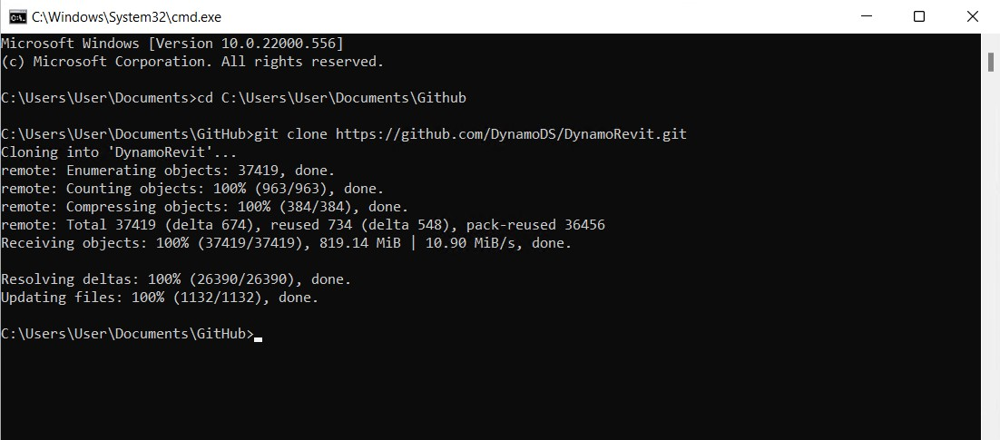
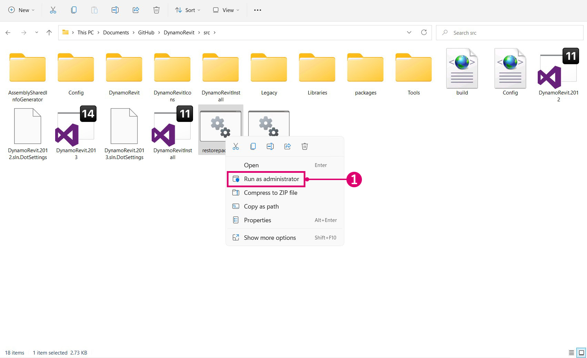
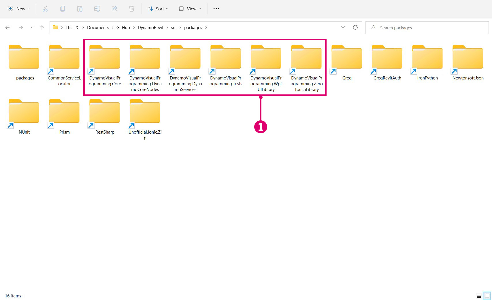
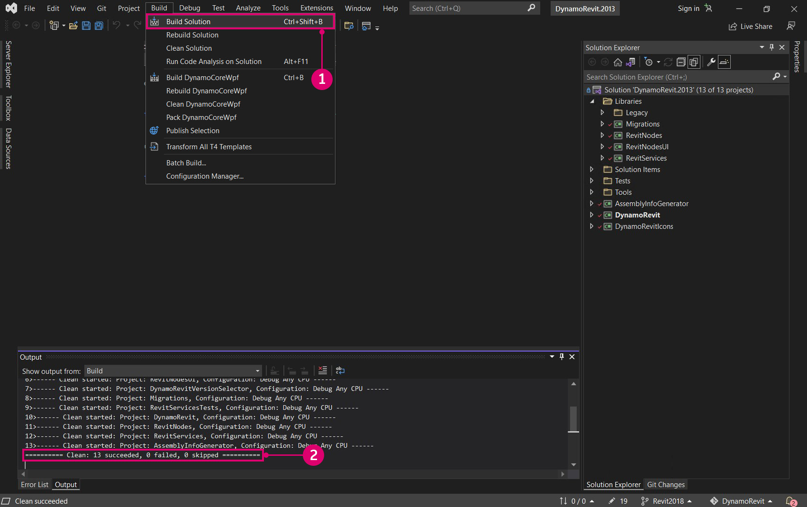
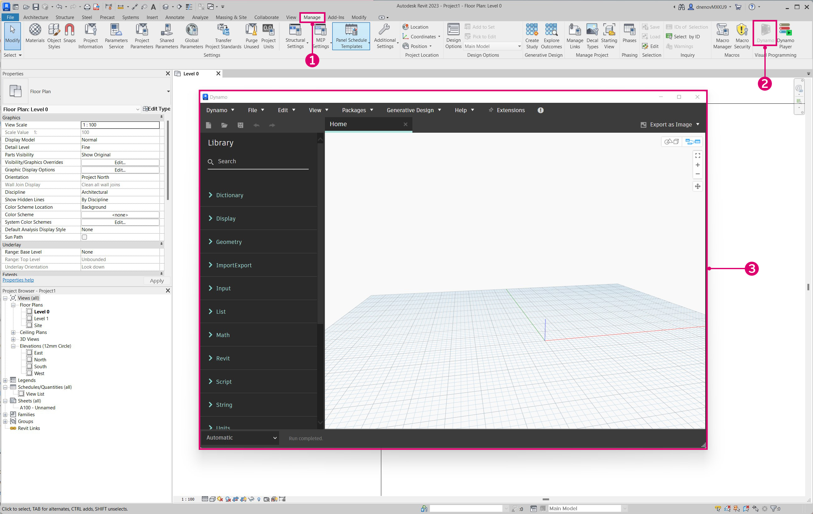
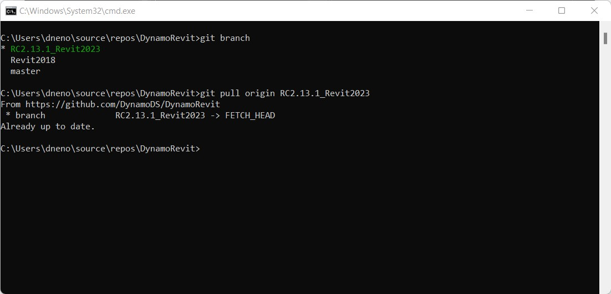

# Build DynamoRevit from Source

The DynamoRevit source files are also hosted on the DynamoDS Github for developers to make contributions and build beta versions. Building DynamoRevit from source generally follows the same process as Dynamo with the exception of a few important details:

* DynamoRevit references Dynamo assemblies, so these should be built with matching NuGet packages. For example, DynamoRevit 2.x will not load into Dynamo 1.3.
* DynamoRevit is specific to Revit versions, for example: the DynamoRevit 2018 branch should run on Revit 2018.

For this guide we will use the following:

* Revit 2018
* The latest DynamoRevit build on branch `Revit2018`
* The latest Dynamo build

To ensure a successful build we will clone and build both the Dynamo and DynamoRevit repositories to use in this walk-through.

_Note: building Dynamo manually before DynamoRevit is only required if you are building Dynamo 1.x and DynamoRevit 1.x - newer versions of the DynamoRevit repository rely on the nuget package manager for the Dynamo dependencies required to build. While a build of DynamoRevit 2.x does not require pulling Dynamo manually you'll still need the core dlls somewhere else to actually run the DynamoRevit addin - so it's worth pulling and building Dynamo anyway. See more below:_ [_Building the repository using Visual Studio_](broken-reference/)

#### Locating the DynamoRevit repository on Github <a href="#locating-the-dynamorevit-repository-on-github" id="locating-the-dynamorevit-repository-on-github"></a>

The code for the DynamoRevit project lives in a separate repository on Github from the core Dynamo source code. This repo contains the the source files for Revit-specific nodes and the Revit addin which loads Dynamo. Builds of DynamoRevit for different versions of Revit (2016, 2017, or 2018, for example) are organized as branches in the repository.

DynamoRevit's source is hosted here: [https://github.com/DynamoDS/DynamoRevit](https://github.com/DynamoDS/DynamoRevit)


> 1. Clone or download the repository
> 2. DynamoRevit's branches reference Revit versions

#### Cloning the repository using git <a href="#cloning-the-repository-using-git" id="cloning-the-repository-using-git"></a>

In a similar process to pulling the Dynamo repository we will use the git clone command to clone DynamoRevit and specify the branch that matches our Revit version. To get started, we will open a command line interface and set the current directory to the location where we want to clone the files to.

`cd C:\Users\username\Documents\GitHub` changes the current directory

> Replace `username` with your username

.jpg>)

We can now clone the repository into this directory. Though we will need to specify a branch of the repository, we can switch to this branch after cloning.

`git clone https://github.com/DynamoDS/DynamoRevit.git` clones the repository from a remote URL and by default switches to the master branch.



Once the repository has finished cloning, change the current directory to the repository folder and switch to the branch that matches the installed version of Revit. For this example, we are using Revit 2018. All remote branches can be viewed on the Github page in the Branch drop-down menu.

`cd C:\Users\username\Documents\GitHub\DynamoRevit` changes the directory to DynamoRevit.\
`git checkout Revit2018` sets the current branch to `Revit2018`.\
`git branch` verifies which branch we are on and shows the others that exist locally.

.jpg>)

> The branch with an asterisk is the one currently checked out. The `Revit2017` branch is showing because we previously checked it out, so it exists locally.

It is important to choose the correct branch of the repository to ensure that when the project builds in Visual Studio it will reference assemblies in the correct version of Revit's installation directory, specifically `RevitAPI.dll` and `RevitAPIUI.dll`.

#### Building the repository using Visual Studio <a href="#building-dynamo-revit" id="building-dynamo-revit"></a>

Before building the repository, we will need to restore the NuGet packages with the `restorepackages.bat` file located in the `src` folder. This bat file uses the [nuget](https://www.nuget.org) package manager to pull built binaries of dynamo core, which DynamoRevit needs. You might also choose to build these manually, but if you are only making changes to DynamoRevit and not Dynamo core. this makes getting started faster. Make sure to run this file as an admin.



> 1. Right-click `restorepackages.bat` and select `Run as administrator`

If the packages are successfully restored, a `packages` folder will be added to the `src` folder with the latest beta NuGet packages.



> 1. The latest beta Dynamo NuGet packages

With the packages restored, open the `Dynamo.Revit.2013.sln` Visual Studio solution file in `src` and build the solution. The build may initially have trouble finding `AssemblySharedInfo.cs`. If so, rerunning the build will resolve this issue.



> 1. Select `Build > Build Solution`
> 2. Verify that the build was successful in the Output window. A message should read `===== Build: 13 succeeded, 0 failed, 0 up-to-date, 0 skipped =====`.

#### Running a local build of DynamoRevit in Revit <a href="#running-a-local-build-of-dynamorevit-in-revit" id="running-a-local-build-of-dynamorevit-in-revit"></a>

Revit requires an add-in file to recognize DynamoRevit, something the [installer](http://dynamobim.org/download/) would create automatically. In development we need to manually create an add-in file that points to the build of DynamoRevit we want to use, specifically the `DynamoRevitDS.dll` assembly. We also need to point DynamoRevit to a build of Dynamo.

Create a `Dynamo.addin` file in Revit's add-in folder located in `C:\ProgramData\Autodesk\Revit\Addins\2018`. We already had a version of DynamoRevit installed, so we will just edit the existing file to point to the new build.

```xml
<?xml version="1.0" encoding="utf-8" standalone="no"?>
<RevitAddIns>
<AddIn Type="Application">
<Name>Dynamo For Revit</Name>
<Assembly>"C:\Users\username\Documents\GitHub\DynamoRevit\bin\AnyCPU\Debug\Revit_2018\DynamoRevitDS.dll"</Assembly>
<AddInId>8D83C886-B739-4ACD-A9DB-1BC78F315B2B</AddInId>
<FullClassName>Dynamo.Applications.DynamoRevitApp</FullClassName>
<VendorId>ADSK</VendorId>
<VendorDescription>Dynamo</VendorDescription>
</AddIn>
</RevitAddIns>
```

* Specify the file path of `DynamoRevitDS.dll` inside of `<Assembly>...</Assembly>`.

Alternatively, we can have the add-in load the version selector instead of a specific assembly.

```xml
<?xml version="1.0" encoding="utf-8" standalone="no"?>
<RevitAddIns>
<AddIn Type="Application">
<Name>Dynamo For Revit</Name>
<Assembly>"C:\Users\username\Documents\GitHub\DynamoRevit\bin\AnyCPU\Debug\Revit_2018\DynamoRevitVersionSelector.dll"</Assembly>
<AddInId>8D83C886-B739-4ACD-A9DB-1BC78F315B2B</AddInId>
<FullClassName>Dynamo.Applications.VersionLoader</FullClassName>
<VendorId>ADSK</VendorId>
<VendorDescription>Dynamo</VendorDescription>
</AddIn>
</RevitAddIns>
```

* Set the `<Assembly>...</Assembly>` file path to `DynamoRevitVersionSelector.dll`
* `<FullClassName>...</FullClassName>` specifies what class to instantiate from the assembly which we pointed to with the assembly element path above. This class will be the entry point for our addin.

The second step is to add a file path for the Dynamo core assemblies to the `Dynamo.config` file in DynamoRevit's `bin` folder. DynamoRevit will load these when the add-in is opened in Revit. This config file lets you point your DynamoRevit addin to different versions of the dynamo core for developing and testing changes in both core and DynamoRevit.

The code should look like this:

```xml
<?xml version="1.0" encoding="utf-8"?>
<configuration>
  <appSettings>
     <add key="DynamoRuntime" value="C:\Users\username\Documents\GitHub\Dynamo\bin\AnyCPU\Debug"/>
  </appSettings>
</configuration>
```

* Add the `bin` folder's directory path to `<add key/>`

> We cloned and built Dynamo right before this walk-through to ensure that it will work well with DynamoRevit. The directory path points to this build.

Now when we open Revit, there should be a Dynamo add-in located in the Manage tab.



> 1. Select `Manage`
> 2. Click the Dynamo add-in icon
> 3. An instance of DynamoRevit

If an error dialog window appears showing missing assemblies, it is likely that there was a mismatch between the versions of DynamoCore that you built against and the ones you are loading at runtime. For example, DynamoRevit with the latest 2.0 beta packages of DynamoCore will not work if you try to start it using Dynamo 1.3 dlls. Make sure that both repos are of the same version and DynamoRevit is pulling a matching version of the nuget dependencies. These are defined in the `package.json` file of the DynamoRevit repo.

#### Debugging DynamoRevit using Visual Studio <a href="#debugging-dynamorevit-using-visual-studio" id="debugging-dynamorevit-using-visual-studio"></a>

In the previous section, **Build Dynamo from Source**, we briefly introduced debugging in Visual Studio and how to attach visual studio to a process. Using an exception in the Wall.ByCurveAndHeight node as an example, we will walk through how to attach to a process, set break points, step through code, and use the call stack to determine the exception's source. These debugging tools apply generally to .net development workflows, and are worth exploring outside of this guide.

* **Attach to process** links a running application to Visual Studio for debugging. If we want to debug behavior occurring in a build of DynamoRevit, we can open the DynamoRevit source files in Visual Studio and attach the `Revit.exe` process, which is the parent process of the DynamoRevit addin. Visual Studio uses a [symbol file](https://msdn.microsoft.com/en-us/library/ms241613.aspx) (`.pbd`) to make the connection between the assemblies DynamoRevit is executing and the source code.
* **Break points** establish lines in the source code where the application will pause before executing. If a node is causing DynamoRevit to crash or return an unexpected result, we can add a break point to the node's source to pause the process, step into the code, and inspect live values of variables until we find the root of the problem
* **Stepping through code** walks through the source line by line. We can run functions one by one, step into a function call, or jump out of the function we're currently executing.
*   **The Call stack** shows the function that a process is currently running relative to the previous function calls which invoked this function call. Visual Studio has a Call Stack window to display this. For example, if we reach an exception outside of the source code, we can see the path to the calling code in the call stack.

    > [2,000 Things You Should Know About C#](https://csharp.2000things.com/2013/05/20/847-how-the-call-stack-works/) has a more in-depth explanation of call stacks

The **Wall.ByCurveAndHeight** node throws an exception when given a PolyCurve as its curve input with the message: _"To BSPlineCurve Not Implemented"_. With debugging we can figure out why exactly the node won't accept this geometry type as an input for the curve parameter. For this example, we are assuming that DynamoRevit has been successfully built and can be run as an add-in for Revit.

> 1. The Wall.ByCurveAndHeight node throwing an exception

Start by opening the `DynamoRevit.2013.sln` solution file, start Revit, and start the DynamoRevit add-in. Then attach Visual Studio to the Revit process with the `Attach to Process` window.

> Revit and DynamoRevit need to be running to show as an available process
>
> 1. Open the `Attach to Process` window by selecting `Debug > Attach to Process...`
> 2. Set `Transport` to `Default`
> 3. Select `Revit.exe`
> 4. Select `Attach`

With Visual Studio attached to Revit, open the Wall.ByCurveAndHeight source code in `Wall.cs`. We can find this in the Solution Explorer under `Libraries > RevitNodes > Elements` in the `Public static constructors` region of the file. Set a break point in the constructor of the wall type so that when node is executed in Dynamo, the process will break and we can step through each line of code individually. Usually Dynamo zero touch type constructors start with `By<parameters>`.

> 1. The class file with the constructor for Wall.ByCurveAndHeight
> 2. Set a breakpoint by either clicking left of the line number or right-clicking on the line of code and select `Breakpoint > Insert Breakpoint`.

With the breakpoint set, we need the process to run through the Wall.ByCurveAndHeight function. The function can be executed again in Dynamo by reconnecting a wire to one of its ports, which will force the node to re-execute. The breakpoint will be hit in Visual Studio.

> 1. The breakpoint icon changes when it is hit
> 2. The Call Stack window showing the method that is up next

Now step over each line in the constructor until we hit the exception. Code highlighted in yellow is the next statement to be run.

> 1. The debugging tools for navigating code
> 2. Press `Step Over` to run the highlighted code then suspend execution after the function returns
> 3. The next statement to run indicated by the yellow highlight and arrow

If we keep stepping through the function, we will hit the exception that displayed in the DynamoRevit window. Looking at the Call Stack window, we can see that the exception is coming from the `Autodesk.LibG.PolyCurve.to_nurbs_curve()` method in `LibG.Managed.dll`. Thankfully the exception is handled here so Dynamo did not crash. The debugging process has provided context for the issue by bringing us to another method in the source code.

`LibG.managed.dll` is not an open source library so we cannot make changes there - now that we have more information we can report the issue with more context by filing a github [issue](https://guides.github.com/features/issues/) or we could propose a workaround for this issue making a pull request.

> 1. When we hit the statement causing the exception in `Walls.cs`, the debugging process brings us as close as it could to the root of the issue in the user code inside `ProtoToRevitCurve.cs`
> 2. The statement causing the exception in `ProtoToRevitCurve.cs`
> 3. In the Call Stack, we can see that the exception is coming from non-user code in `LibG.Managed.dll`
> 4. A pop-up window giving us information about the exception

This process can be applied to any source files we are working with. If we are developing a library of Zero-Touch nodes for Dynamo Studio, we can open the library's source and attach a Dynamo process to debug the node library. Even if everything is functioning perfectly, debugging is a great way to explore code and find out how things are working.

#### Pull latest build <a href="#pull-latest-build" id="pull-latest-build"></a>

This process is nearly identical to pulling changes for Dynamo, except that we will need to ensure that we are on the correct branch. Use the `git branch` command in the DynamoRevit repository to see which branches are available locally and which are currently checked out.

`cd C:\Users\username\Documents\GitHub\DynamoRevit` sets the current directory to the DynamoRevit repository.\
`git branch` verifies we are on the correct branch, `Revit2017`.\
`git pull origin Revit2017` pulls changes from the remote origin `Revit2017` branch.

Origin simply points to the original url we cloned.



> We want to be mindful here of which branch we are currently on and which one we are pulling from to avoid pulling changes from `Revit2018` into `Revit2017` for example.

As mentioned in **Build Dynamo from Source**, when we are ready to submit a change to the DynamoRevit repository we can create a pull request following the Dynamo team's guidelines laid out in the Pull Requests section.
