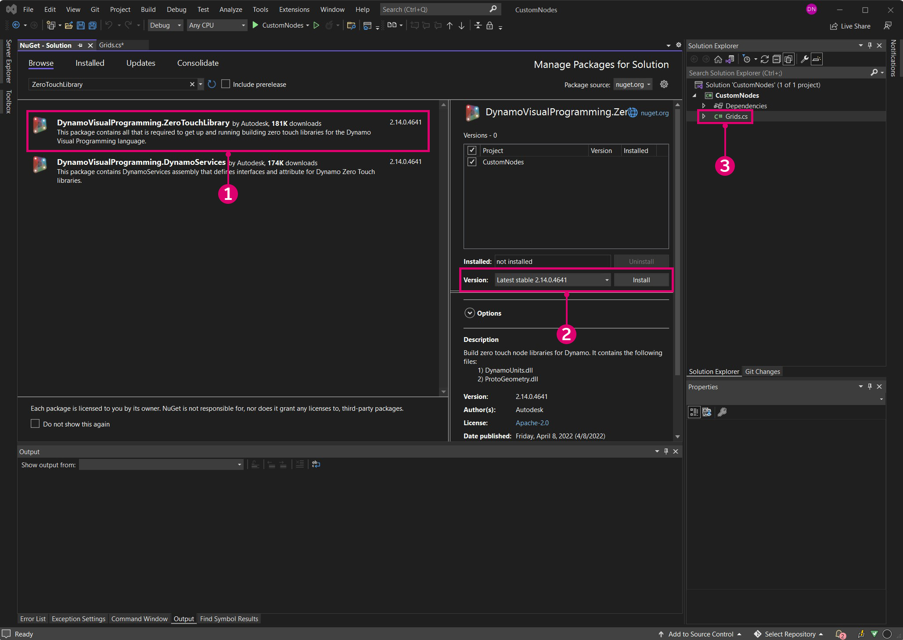
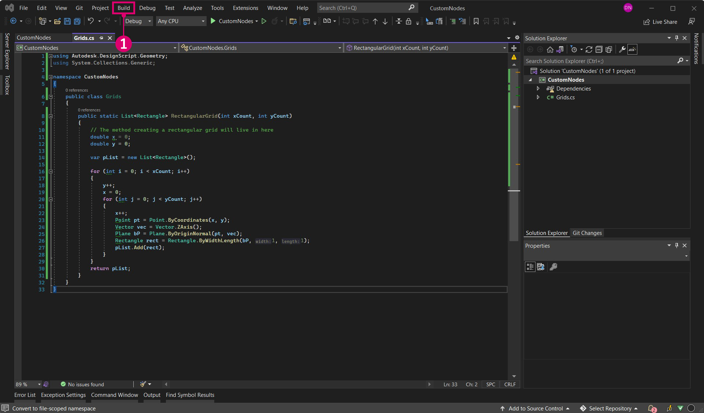
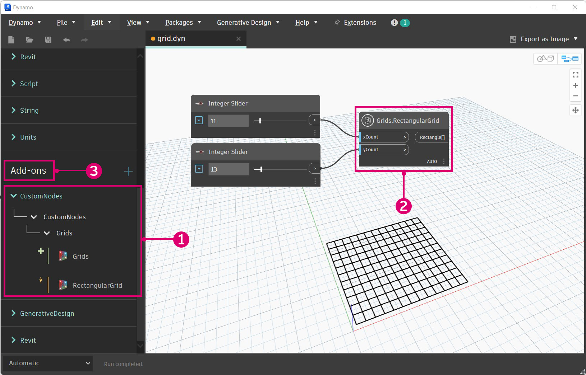
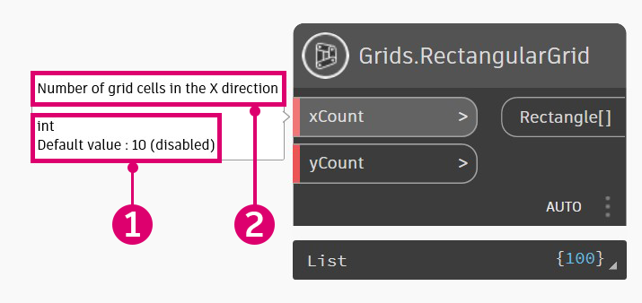

# Zero-Touch Case Study - Grid Node

With a Visual Studio project up and running, we will walk through how to build a custom node that creates a rectangular grid of cells. Though we could create this with several standard nodes, it is a useful tool that can be easily contained in a Zero-Touch node. As opposed to grid lines, cells can be scaled about their center points, queried for their corner vertices, or built into faces.

This example will touch on a few of the features and concepts to be aware of when creating a Zero-Touch node. After we build the custom node and add it to Dynamo, make sure review the Going Further with Zero-Touch page for a deeper look at default input values, returning multiple values, documentation, objects, using Dynamo geometry types, and migrations.


#### Custom Rectangular Grid Node <a href="#custom-rectangular-grid-node" id="custom-rectangular-grid-node"></a>

To start building the grid node, create a new Visual Studio class library project. Refer to the Getting Started page for an in-depth walk-through of how to set up a project.

.jpg>)

.jpg>)

> 1. Choose `Class Library` for the project type
> 2. Name the project `CustomNodes`

Since we will be creating geometry, we need to reference the appropriate NuGet package. Install the ZeroTouchLibrary package from the Nuget Package Manager. This package is necessary for the `using Autodesk.DesignScript.Geometry;` statement.



> 1. Browse for the ZeroTouchLibrary package
> 2. We will be using this node in the current build of Dynamo Studio, which is 1.3. Select the package version that matches this.
> 3. Notice that we have also renamed the class file to `Grids.cs`

Next, we need to establish a namespace and class in which the RectangularGrid method will live. The node will be named in Dynamo according to the method and class names. We don't have to copy this into Visual Studio yet.

```csharp
using Autodesk.DesignScript.Geometry;
using System.Collections.Generic;

namespace CustomNodes
{
    public class Grids
    {
        public static List<Rectangle> RectangularGrid(int xCount, int yCount)
        {
        //The method for creating a rectangular grid will live in here
        }
    }
}
```

> `Autodesk.DesignScript.Geometry;` references the ProtoGeometry.dll in the ZeroTouchLibrary package `System.Collections.Generic` is necessary for creating lists

Now we can add the method for drawing the rectangles. The class file should look like this and can be copied into Visual Studio.

```csharp
using Autodesk.DesignScript.Geometry;
using System.Collections.Generic;

namespace CustomNodes
{
    public class Grids
    {
        public static List<Rectangle> RectangularGrid(int xCount, int yCount)
        {
            double x = 0;
            double y = 0;

            var pList = new List<Rectangle>();

            for (int i = 0; i < xCount; i++)
            {
                y++;
                x = 0;
                for (int j = 0; j < yCount; j++)
                {
                    x++;
                    Point pt = Point.ByCoordinates(x, y);
                    Vector vec = Vector.ZAxis();
                    Plane bP = Plane.ByOriginNormal(pt, vec);
                    Rectangle rect = Rectangle.ByWidthLength(bP, 1, 1);
                    pList.Add(rect);
                }
            }
            return pList;
        }
    }
}
```

If the project looks similar to this, go ahead and try to build the `.dll`.



> 1. Choose Build > Build Solution

Check the project's `bin` folder for a `.dll`. If the build was successful, we can add the `.dll` to Dynamo.



> 1. The custom RectangularGrids node in the Dynamo Library
> 2. The custom node on the canvas
> 3. The Add button for adding the `.dll` to Dynamo

#### Custom Node Modifications <a href="#custom-node-modifications" id="custom-node-modifications"></a>

In the example above, we created a fairly simple node that didn't define much else outside of the `RectangularGrids` method. However, we may want to create tooltips for input ports or give the node a summary like the standard Dynamo nodes. Adding these features to custom nodes makes them easier to use, especially if a user wants to search for them in the Library.



> 1. A default input value
> 2. A tool tip for the xCount input

The RectangularGrid node needs some of these basic features. In the code below, we have added input and output port descriptions, a summary, and default input values.

```csharp
using Autodesk.DesignScript.Geometry;
using System.Collections.Generic;

namespace CustomNodes
{
    public class Grids
    {
        /// <summary>
        /// This method creates a rectangular grid from an X and Y count.
        /// </summary>
        /// <param name="xCount">Number of grid cells in the X direction</param>
        /// <param name="yCount">Number of grid cells in the Y direction</param>
        /// <returns>A list of rectangles</returns>
        /// <search>grid, rectangle</search>
        public static List<Rectangle> RectangularGrid(int xCount = 10, int yCount = 10)
        {
            double x = 0;
            double y = 0;

            var pList = new List<Rectangle>();

            for (int i = 0; i < xCount; i++)
            {
                y++;
                x = 0;
                for (int j = 0; j < yCount; j++)
                {
                    x++;
                    Point pt = Point.ByCoordinates(x, y);
                    Vector vec = Vector.ZAxis();
                    Plane bP = Plane.ByOriginNormal(pt, vec);
                    Rectangle rect = Rectangle.ByWidthLength(bP, 1, 1);
                    pList.Add(rect);
                    Point cPt = rect.Center();
                }
            }
            return pList;
        }
    }
}
```

* Give the inputs default values by assigning values to the method parameters: `RectangularGrid(int xCount = 10, int yCount = 10)`
* Create input and output tooltips, search keywords, and a summary with XML documentation preceded by `///`.

To add tooltips, we need an xml file in the project directory. A `.xml` can be automatically generated by Visual Studio by enabling the option.

.jpg>)

> 1. Enable XML documentation file here and specify a file path. This generates an XML file.

That's it! We have created a new node with several standard features. The following chapter Zero-Touch Basics goes into greater detail about Zero-Touch node development and the issues to be aware of.

### results matching ""

*

### No results matching ""
