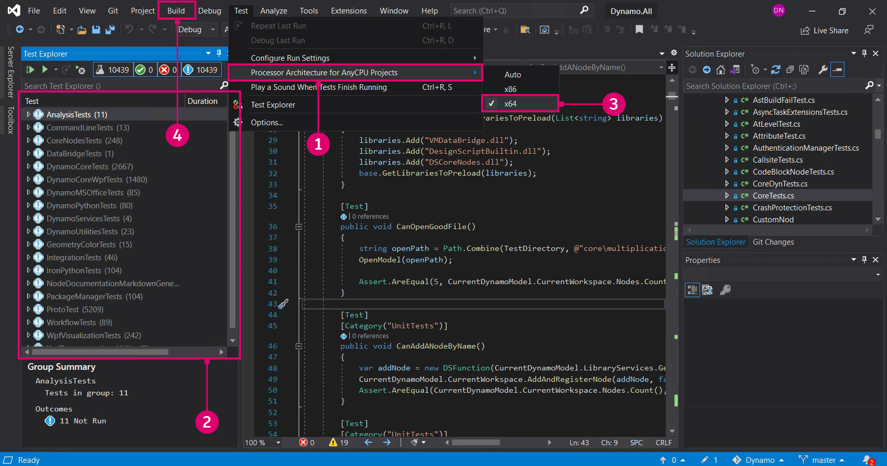
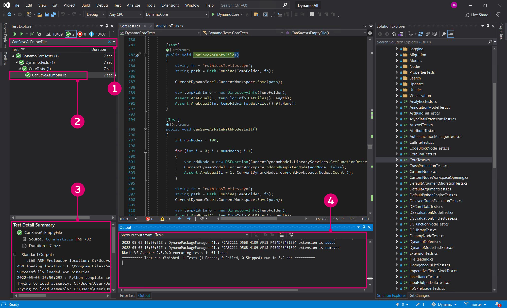
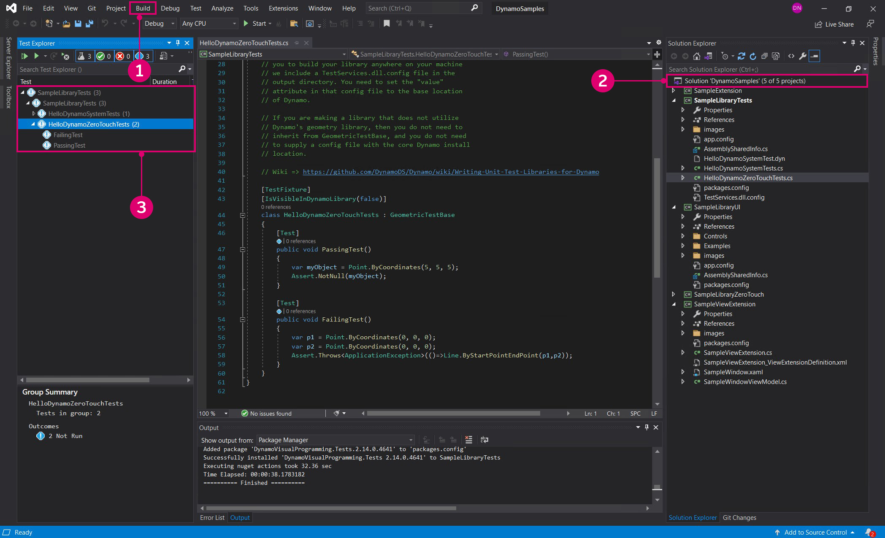
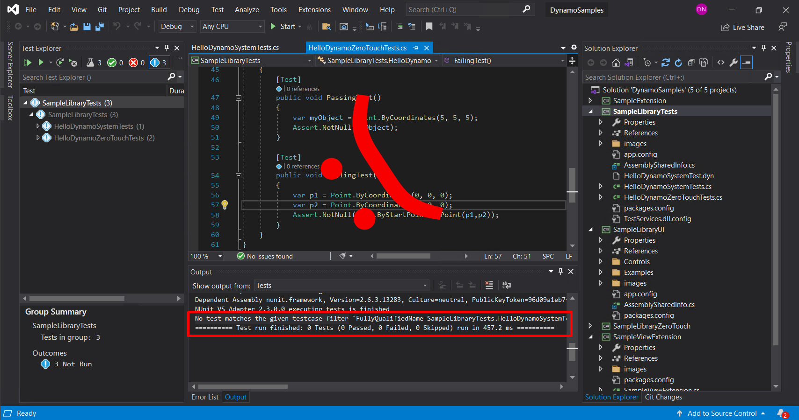

# Testing

Tests give developers a way to ensure reliability and dramatically improve the quality of third-party development. For the Dynamo project, tests are expected with pull requests to help the Dynamo development team know that a new feature or bug fix is robust. The Dynamo source repository contains thousands of unit tests and is an excellent reference for learning how to write one. The DynamoSamples repository also contains basic examples of tests that we will walk through in this section.

#### Introduction to testing expectations <a href="#introduction-to-testing-expectations" id="introduction-to-testing-expectations"></a>

Unit tests are expected when making a pull request to Dynamo and are generally a good practice during development. They need to be included in pull requests for the following reasons:

* To prove how a current behavior is broken for a bug we want to fix.
* To prove the reliability of a new feature, new node or even just new APIs.

For example, if another contributor makes a change that causes a node we created to stop functioning properly, it should also cause any tests we created to fail. This helps to eliminate possible causes of an issue and identify its source.

#### Unit and System tests <a href="#unit-and-system-tests" id="unit-and-system-tests"></a>

The Dynamo project uses two types of tests: unit and system.

* Unit tests test small "units" of code, such as methods, to find logic errors.
* System tests test the entire system similar to how a user would interact with Dynamo. This typically involves creating a Dynamo session, opening a Dynamo file, evaluating it, and ensuring that the results are what we expected.

#### Test dependencies <a href="#test-dependencies" id="test-dependencies"></a>

Several libraries are provided with Dynamo that contain base classes and utility methods for testing. If we want to write a test in a package we are developing, we will need to reference the `DynamoVisualProgramming.Testing` package from the NuGet package manager to get the following libraries:

* `TestServices.dll` contains the base class for Dynamo unit tests.
* `SystemTestServices.dll` contains the base class for Dynamo system tests.

These libraries contain base classes that will handle operations such as initializing Dynamo and its geometry library for unit tests or providing access to the Dynamo workspace in system tests.

* `GeometricTestBase` for unit tests that use the geometry library
* `SystemTestBase` for system tests that start Dynamo and use `.dyn` files

#### How to run a test <a href="#how-to-run-a-test" id="how-to-run-a-test"></a>

Before we write a test, running one located in Dynamo's source files will illustrate the process and results.

First we need to install the [NUnit 2 Test Adapter](https://marketplace.visualstudio.com/items?itemName=NUnitDevelopers.NUnitTestAdapter) so that Visual Studio discovers the tests.

In Visual Studio open the Dynamo solution file `Dynamo.All.sln` and the Test Explorer. Set the test settings to `x64` otherwise the tests will not run, then build the solution.



> 1. Select `Test > Windows > TestExplorer` to show the tests
> 2. The TestExplorer window
> 3. Select `Test > Test Settings > Default Processor Architecture > X64`
> 4. Build the project by selecting `Build > Build Solution`. All available tests will appear in the TestExplorer `Not Run Tests` category.

Select a test to run. The `CanSaveImage()` test from `DynamoCoreWpfTests` will test Dynamo for whether or not it can save an image. Running the test will open Dynamo, add a node, and capture an image all very quickly.



> 1. Search for `CanSaveImage`
> 2. Right-click on the test and select `Run Selected Tests`. If the test runs successfully it will be under the `Passed Test` category.
> 3. Time elapsed for the test
> 4. The output of the test. Here we can see that the test created a new home workspace.

#### How to write tests for a package <a href="#how-to-write-tests-for-a-package" id="how-to-write-tests-for-a-package"></a>

Most tests we create for packages will be unit tests. They should be small, fast, and reliable. If we want to test a Zero-Touch node, the test should test only that DLL and make calls directly to that code. We will walk through how to set up a package with tests using the DynamoSamples repository.

Start by downloading the Github repository for [DynamoSamples](https://github.com/DynamoDS/DynamoSamples) and opening the Visual Studio solution file. We also need to add the Tests package with the NuGet package manager.

.jpg>)

> 1. The Tests package
> 2. Install for the `SampleLibraryTests` project
> 3. Click `Install`

To run tests we need to point the test libraries to Dynamo's installation directory with a `TestServices.dll.config` file in the `SampleTestsLibrary` project folder. DynamoSamples already has this file, otherwise we would need to create one.

* We have Dynamo installed in `C:\Program Files\Dynamo\Dynamo Core\1.3`

```
<?xml version="1.0" encoding="utf-8" ?>
<configuration>
  <appSettings>
    <add key="DynamoBasePath" value="C:\Program Files\Dynamo\Dynamo Core\1.3"/>
    <add key="RequestedLibraryVersion2" value="226.0.0"/>
  </appSettings>
</configuration>
```

Now build the solution to get the tests. If we open the `Test Explorer` window there should be three tests from the `SampleLibraryTests` project. Tests should be contained in a separate project. If we wanted to test a method in this project, we would need to reference that library in the test project.



> 1. Build the solution to get the tests with `Build > Build Solution`
> 2. A separate `SampleLibraryTests` project
> 3. The tests in DynamoSamples

The tests we see in `HelloDynamoZeroTouch.cs` are very basic but include the key components.

* A `using NUnit.Framework;` statement to use NUnit
* A `using TestServices;` statement since we are using geometry in the tests
* A `[TestFixture]` attribute that marks a class that contains tests
* A `[Test]` attribute that marks a method as a test
* A `void` method since nothing needs to be returned out
* An `Assert` method that upon failure does not return and posts an error

```
using System;
using Autodesk.DesignScript.Geometry;
using Autodesk.DesignScript.Runtime;
using NUnit.Framework;
using TestServices;

namespace SampleLibraryTests
[Test]
    [TestFixture]
    [IsVisibleInDynamoLibrary(false)]
    class HelloDynamoZeroTouchTests : GeometricTestBase
    {
        [Test]
        public void PassingTest()
        {
            var myObject = Point.ByCoordinates(5, 5, 5);
            Assert.NotNull(myObject);
        }

        [Test]
        public void FailingTest()
        {
            var p1 = Point.ByCoordinates(0, 0, 0);
            var p2 = Point.ByCoordinates(0, 0, 0);
            Assert.Throws<ApplicationException>(()=>Line.ByStartPointEndPoint(p1,p2));
        }
    }
}
```

> `public void FailingTest()` tests if Dynamo will throw an exception when the `Line.ByStartPointEndPoint(p1,p2)` method is given identical points, which is impossible to create a line from.

If we replace the `Assert` statement in the `FailingTest` with `Assert.NotNull(myObject);`, we are testing if `Line.ByStartPointEndPoint(p1,p2)` can create a line from points in at identical locations. Replace the code and run the test to see what a failure looks like.



> 1. The `Assert` statement we modified
> 2. The failed `FailingTest`. Normally this is testing if the node can fail by throwing an exception.
> 3. Information about the test results

Now we are set up to write tests for any package we create. For an extensive list of reference tests take a look at the [Dynamo source](https://github.com/DynamoDS/Dynamo/tree/master/test).

*
