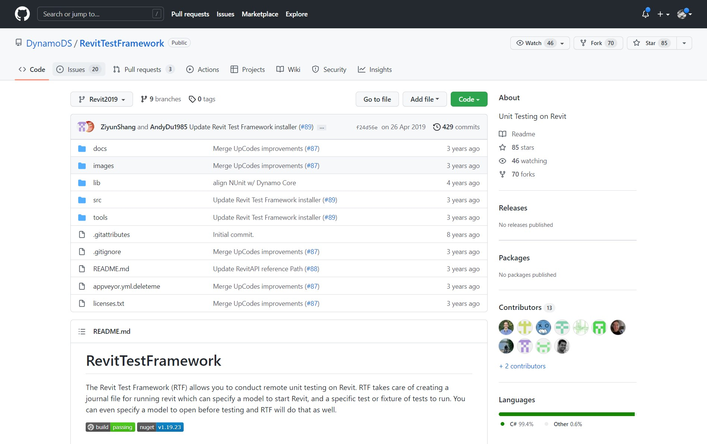
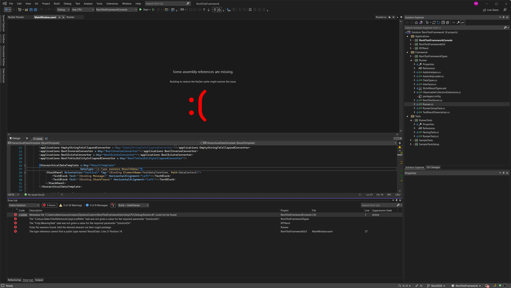

# Testing for DynamoRevit

If we are developing a package for Revit or working with the DynamoRevit source code, the tests we write need to incorporate both Revit and Dynamo functionality. A test could involve opening both a Revit file and Dynamo file, then adding a DynamoRevit node to the workspace to simulate how a user would create a graph. Writing a test for DynamoRevit will generally follow the walk-through in the Testing section with the addition of several steps. Running tests for Revit and DynamoRevit is a more involved process since we are launching multiple applications and referencing other libraries.

#### The Revit Test Framework <a href="#the-revit-test-framework" id="the-revit-test-framework"></a>

The Revit Test Framework (RTF) allows for remote testing on Revit. RTF creates a journal file for running Revit, specifies a model for it to open, and a specific test or fixture of tests to run. A model can also be specified to open before testing to run several tests with.

The Revit Test Framework is open source and hosted on Github: [https://github.com/DynamoDS/RevitTestFramework](https://github.com/DynamoDS/RevitTestFramework)



Using the same git commands from the walk-through in Build DynamoRevit From Source, we can clone and build the repository to run RTF. Open a new command prompt and enter the following commands:

* `cd "C:\Users\username\Documents\GitHub"` to set the directory into which the repository will be cloned
* `git clone https://github.com/DynamoDS/RevitTestFramework.git` to clone the repository from its URL
* `cd "C:\Users\username\Documents\GitHub\RevitTestFramework"` to set the current directory to the repository
* `git checkout Revit2018` switches to a branch of RTF matching the installed Revit version, similar to the process in building DynamoRevit from source

Once the repository is cloned, open the solution file in Visual Studio and build the solution. In the `bin` folder are two options for running RTF:

* **RevitTestFrameworkGUI.exe** provides a visual interface to select tests from a treeview and visualize the results of the tests as they are run. Testing configurations can be saved to run again later.
* **RevitTestFrameworkConsole.exe** is a console application which allows running RTF from a command line. All the settings in the GUI are available here as well.

#### How to run a test for DynamoRevit in the GUI <a href="#how-to-run-a-test-for-dynamorevit-in-the-gui" id="how-to-run-a-test-for-dynamorevit-in-the-gui"></a>

Tests are run in the RevitTestFramework by specifying an assembly containing the tests and any supporting references. We can start by running a test that comes with the DynamoRevit repository in the GUI application. Start by opening the `RevitTestFrameworkGUI.exe` application in the `bin` folder of the build.



> RTF loads a default test from its `bin` folder when it starts
>
> 1. Select `File` to save or load a local RTF config
> 2. Set the `Test Assembly` path, the location of the assembly containing the tests to run. (e.x. RevitNodesTests.dll, RevitSystemTests.dll, RevitServicesTests.dll which can be found usually in DynamoRevit bin folder)
> 3. Set the `Results File Path`, the result file is an.xml file that will contain the test results. If the path points to an existing file, RTF will overwrite it
> 4. Set the `Working Directory`, the location of the testing files
> 5. Set the `Additional Resolution Directories` to assemblies that the test assembly will need to load (e.x. the Dynamo Core location when it is not set in the `Dynamo.Config` in DynamoRevit bin folder)
> 6. Specify the `Revit version` to run the tests with
> 7. Select `Debug` to launch a debugging session with the test
> 8. Select `Run Selected Tests` to run the tests

For this example we will run one test from `RevitSystemTests`. Add the `RevitSystemTests` assembly from DynamoRevit and select `CreateWallByFace` under `WallTests`. If the assembly does not load, try adding `SystemTestServices.dll` to `Additional Resolution Directories` from DynamoCore.

> The test passed, shown by the green highlighting. The name of the Revit model associated with a test will turn green if the working directory is set correctly.
>
> 1. Set the `Test Assembly`, `Results File Path`, and the `Working Directory`
> 2. Select only the `CreateWallByFace` test
> 3. Select `Run Selected Tests`

Whether a test passes or fails, it will write its results to the file specified in `Results File Path`. The output file from a test run is an NUnit-formatted results file compatible with many CI systems. Open the `Test_Results.xml` file for more information on the test we just ran.

```
<?xml version="1.0" encoding="utf-8"?>
<!--This file represents the results of running a test suite-->
<test-results name="C:\Users\paul\Documents\DynamoRevit\bin\AnyCPU\Debug\Revit_2018\RevitSystemTests.dll" total="1" failures="0" not-run="0" date="2018-01-02" time="22:00:03" errors="0" inconclusive="0" ignored="0" skipped="0" invalid="0">
  <test-suite name="DynamoTestFrameworkTests" description="Unit tests in Revit." time="5.6363755" asserts="6" type="TestFixture" result="Success" executed="True">
    <results>
      <test-suite name="WallTests" description="Unit tests in Revit." time="5.6363755" asserts="6" type="TestFixture" result="Success" executed="True">
        <results>
          <test-case name="CreateWallByFace" success="True" time="5.6363755" executed="True" asserts="6" result="Success" />
        </results>
      </test-suite>
    </results>
  </test-suite>
</test-results>
```

Since this test configuration is working, we can save these settings for another session in a `.xml` file.

> 1. Select `File > Save As...`

#### How to run a test for DynamoRevit in the Console <a href="#how-to-run-a-test-for-dynamorevit-in-the-console" id="how-to-run-a-test-for-dynamorevit-in-the-console"></a>

Alternatively, we can run tests from the command line with all the options we had in the GUI application. Open a command prompt from the directory of the `RevitTestFrameworkConsole.exe` application and enter the following command:

* `RevitTestFrameworkConsole -h` shows all available commands

```
  Options:   
         --dir=[VALUE]          The full path to the working directory. The working directory is the directory in which RTF will generate the journal and the addin to Run Revit. Revit's run-by-journal capability requires that all addins which need to be loaded are in the same directory as the journal file. So, if you're testing other addins on top of Revit using RTF, you'll need to put those addins in whatever directory you specify as the working directory.  
    -a,  --assembly=[VALUE]     The full path to the assembly containing your tests.  
    -r,  --results=[VALUE]      This is the full path to an .xml file that will contain the results. 
    -f,  --fixture=[VALUE]      The full name (with namespace) of a test fixture to run. If no fixture, no category and no test names are specified, RTF will run all tests in the assembly.(OPTIONAL)  
    -t,  --testName[=VALUE]     The name of a test to run. If no fixture, no category and no test names are specified, RTF will run all tests in the assembly. (OPTIONAL)    
         --category[=VALUE]     The name of a test category to run. If no fixture, no category and no test names are specified, RTF will run all tests in the assembly. (OPTIONAL)   
         --exclude[=VALUE]      The name of a test category to exclude. This has a higher priortiy than other settings. If a specified category is set here, any test cases that belongs to that category will not be run. (OPTIONAL)  
    -c,  --concatenate          Concatenate the results from this run of RTF with an existing results file if one exists at the path specified. The default behavior is to replace the existing results file. (OPTIONAL)  
         --revit[=VALUE]        The Revit executable to be used for testing. If no executable is specified, RTF will use the first version of Revit that is found on the machine using the RevitAddinUtility. (OPTIONAL)  
         --copyAddins           Specify whether to copy the addins from the Revit folder to the current working directory. Copying the addins from the Revit folder will cause the test process to simulate the typical setup on your machine. (OPTIONAL)  
         --dry                  Conduct a dry run. (OPTIONAL)  
    -x,  --clean                Cleanup journal files after test completion. (OPTIONAL)   
         --continuous           Run all selected tests in one Revit session. (OPTIONAL)  
         --time                 The time, in milliseconds, after which RTF will close the testing process automatically. (OPTIONAL)  
    -d,  --debug                Should RTF attempt to attach to a debugger?. (OPTIONAL)  
    -h,  --help                 Show this message and exit. (OPTIONAL)
```

If we wanted to run the same test that we did in the GUI, we can specify all options in a single command separated by spaces.

* `RevitTestFrameworkConsole` precedes the options
* `--dir="C:\Users\username\Documents\DynamoRevit\test\System"` sets the working directory
* `-a="C:\Users\username\Documents\DynamoRevit\bin\AnyCPU\Debug\Revit_2017\RevitSystemTests.dll"` sets the test assembly
* `-r="C:\Users\username\Documents\RevitTestFramework\bin\AnyCPU\Debug\Test_Results.xml"` sets the results file path
* `-t=CreateWallByFace` specifies the test to run

#### How to write DynamoRevit tests <a href="#how-to-write-dynamorevit-tests" id="how-to-write-dynamorevit-tests"></a>

Writing a test that involves Dynamo and Revit requires the same setup covered in testing for Dynamo Core with a few extra steps. In addition to the test libraries provided for Dynamo, DynamoRevit provides `RevitTestServices.dll`, a library containing base classes and methods for testing with Revit. This walk-through will cover how to setup a Visual Studio project for writing a Revit test. First, we need to reference `RevitTestServices.dll` and a few other assemblies. Create a new Visual Studio project or open an existing one and add the following references.

* `RevitTestServices.dll` contains two base classes, `RevitNodeTestBase` and `RevitSystemTestBase`, for unit and system testing that involves Revit
* `SystemTestServices.dll` is provided by DynamoCore and is required for `RevitTestServices.dll`
* `RevitTestFrameworkTypes.dll` is provided by RTF and contains `TestModelAttribute` for specifying a Revit model to open when a test runs
* `DynamoCore.dll` contains Dynamo's core model

We also need to reference these assemblies for this specific example.

* `DynamoCoreWpf.dll` for accessing Dynamo's view model
* `RevitNodes.dll` for using DynamoRevit nodes

> 1. Right click on `References` and select `Add Reference...`
> 2. Browse to the locations of each reference
> 3. All six references we need for this project
> 4. Select `Ok`

By default, these assemblies will be set to `Copy Local = True`. Once they are added, select them and change this property to `False`.

> 1. Select the assemblies we referenced
> 2. Set `Copy Local` to `False`

For this example, we can use the `CreateWallByFace` test as the sample test. Add the following code to an empty class in the project.

```
using System.IO;
using NUnit.Framework;
using RevitTestServices;
using RTF.Framework;

namespace RevitSystemTests
{
    [TestFixture]
    class WallTests : RevitSystemTestBase
    {
        [Test]
        [TestModel(@".\InPlaceMass.rvt")]
        public void CreateWallByFace()
        {
            var model = ViewModel.Model;

            string samplePath = Path.Combine(workingDirectory, @".\Wall\WallByFace.dyn");
            string testPath = Path.GetFullPath(samplePath);

            ViewModel.OpenCommand.Execute(testPath);

            RunCurrentModel();

            var wall = GetPreviewValue("e3e5735c-98d2-47ac-97fb-90a5f08c416e");
            Assert.IsNotNull(wall);
            Assert.IsTrue(wall.GetType() == typeof(Revit.Elements.FaceWall));
        }
    }
}
```

The structure of the test is similar to DynamoCore tests with several key differences.

* The `RevitTestServices` using statement provides Revit test base classes
* The `RTF.Framework` using statement provides an attribute used to specify a Revit model
* A class that inherits `RevitSystemTestBase` to use functions specific to Revit System tests
* A `[TestModel(@".\InPlaceMass.rvt")]` attribute from RTF to specify a Revit model with which to run the test
* A Dynamo file path `string samplePath = Path.Combine(workingDirectory, @".\Wall\WallByFace.dyn");` that specifies a Dynamo file to run
* A `RunCurrentModel()` method to run the Dynamo file

Notice that the test uses a test model `InPlaceMass.rvt` and a Dynamo file `WallByFace.dyn`. Create a `test` folder in the project directory and copy these files from the DynamoRevit `test` folder into it.

> 1. The Dynamo and Revit files copied from the DynamoRevit repository
> 2. The `test` folder inside the project directory that will serve as the working directory

Now build the project and run the test in the RTF GUI application.

> 1. Set the test assembly path to the `Test.dll` we just built
> 2. Specify a results file
> 3. Set the working directory to the location of the copied Revit and Dynamo files
> 4. Make sure the correct version of Revit is selected, 2018 in this example
> 5. Select `Run Selected Tests`
> 6. The test will become highlighted green if it runs successfully, otherwise it will become highlighted red if it failed

The DynamoRevit repository has many tests to use as a reference when writing new ones for a package under `Tests > Libraries` in the Visual Studio Solution Explorer.
